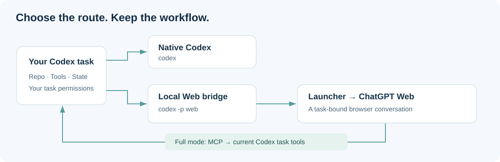

# Codex Web Harness

**Put your ChatGPT plan to work. Read the repo, change the code, run the tests—from Codex.**

[简体中文](README.zh-CN.md) · [Installation & profiles](docs/GETTING_STARTED.md) · [Build & release](docs/BUILDING.md) · [Troubleshooting](TROUBLESHOOTING.md)

[](https://github.com/cloverpray/codex-web-harness/actions/workflows/ci.yml)
[](LICENSE)
[](docs/VALIDATION.md)


Already paying for ChatGPT? Bring its available Web reasoning modes into your development workflow. Codex Web Harness connects ChatGPT in the browser to a Codex task, so it can work with selected project files, call permitted local tools, and follow the results.

You stay in the terminal. The model works through the Web. This unofficial launcher handles the bridge.

Derived from [miuuyy/codex-chatgpt-web](https://github.com/miuuyy/codex-chatgpt-web). See [provenance and changes](docs/CHANGES.md). This project is not affiliated with OpenAI.

## More work from the access you already have

Long debugging sessions and repeated experiments can add up on a metered model API. This project gives you another route: **use your available ChatGPT Web allowance for those sessions, without model API token charges for the Web inference itself.**

That is the practical saving: get more use from access you already have. Your ChatGPT plan, supported models and usage limits still apply; this does not turn a free account into Pro. Full-mode tool access has its own setup requirements. For API budgeting, check the current [GPT-6 Astra pricing](https://developers.openai.com/api/docs/models/gpt-6-astra) rather than a screenshot of yesterday's prices.

Native Codex also supports [ChatGPT-plan access](https://help.openai.com/en/articles/11369540-using-codex-with-your-chatgpt-plan). Choose this harness when you specifically want the **Web reasoning route and its available modes** in a Codex task.

## What can you build with it?

| Developer task | How the harness helps |
|---|---|
| Debug a repository | Let a Web model inspect selected files, run permitted local commands, and use test output in the same Codex task. |
| Review or implement a change | Keep your terminal, task context and native tool presentation while choosing an available Web reasoning route. |
| Continue a long investigation | Resume the task after supported compaction, with authoritative checkpoints and artifacts kept on disk. |
| Ask for a second opinion | Optionally use a [Pro teacher](extras/research) with a compact evidence packet while the main executor owns all writes. |
| Keep native Codex nearby | Use an explicit Web profile rather than making every session use the browser route. |

Try it on a bug that needs a few substantial reads and test runs, or an investigation where careful reasoning matters more than instant tool round trips. Browser transport adds overhead; many tiny sequential calls are still better served by native Codex.

## Upstream strengths, focused improvements

The upstream project supplies the core capability: a cross-platform desktop launcher, embedded ChatGPT sign-in, Web reasoning routes, streaming back to Codex, and Full-mode tools through MCP. This fork builds on that work.

| Area | Upstream v5.0.6 baseline | This preview adds |
|---|---|---|
| Local tool workflow | Codex task tools connected through MCP | Additional recursion checks across discovery, dispatch and nested execution |
| Model routing | Launcher-managed model integration | Explicit Web profile support and a separate model catalog |
| Long conversations | Existing compaction and task continuation | Codex 0.154 Responses-based text compaction recovery |
| Context transport | Task-bound retained conversations | Omission of unchanged static instructions and confirmed history prefixes |
| Failure handling | Browser and bridge lifecycle management | Pre-stream environment rejection and explicit cancellation-settlement checks |
| Teacher coordination | Fixed 30-second Web waits | A bounded 55-second option for evidence-only teachers, keeping 30-second worker waits |

The aim is to make long tasks easier to finish: send less repeated context, recover supported compacted sessions, and reject recursive tool requests before they become timeouts. We have not measured a general speedup over upstream or native Codex. [Changes and provenance](docs/CHANGES.md) · [Validation](docs/VALIDATION.md).

## How it fits together



<details>
<summary><strong>See the inherited launcher interface</strong></summary>


Upstream interface demonstration, included with attribution. This is not a recording of the fork's new compaction or latency tests; current behavior and limits are documented below.

</details>

## Get started

1. Download the matching preview installer from [Releases](https://github.com/cloverpray/codex-web-harness/releases).
2. Open the launcher and sign in to ChatGPT in its embedded browser.
3. Follow the browser verification and model setup steps. For local tools, complete the launcher's MCP/Tunnel setup and **Verify runtime**.
4. Configure the opt-in profile using [the profile guide](docs/GETTING_STARTED.md). Installing the app alone does **not** automatically create the `web` profile.

With the profile configured:

```bash
# Existing native configuration
codex

# Explicit Web session
codex -p web -m chatgpt-web/high -c model_reasoning_effort=high

# Pro, when available in the signed-in account
codex -p web -m chatgpt-web/pro -c model_reasoning_effort=ultra

# Resume an existing Web task
codex -p web resume YOUR_SESSION_ID
```

The model slug selects the Web effort. Availability depends on the account and current ChatGPT interface. `High` and `Pro` are Web routes, not a promise of identical native model snapshots or reasoning budgets.

## Platforms and validation

| Platform | Package | Validation for this fork |
|---|---|---|
| Linux x64 | AppImage | Local authenticated workflow exercised; CI builds and smoke tests |
| Windows x64 | Installer `.exe` | CI build and smoke passed; real-account validation pending |
| macOS arm64 / x64 | `.dmg`, `.zip` | Both CI builds and smoke checks passed; real-account validation pending |

The last pre-extraction Linux runtime suite passed **716 tests, with 1 platform skip**. A long-session recovery test completed compaction and the following reply; a subsequent resume also completed. These are correctness observations, **not a native-versus-Web speed benchmark**. Current source validation and release status are recorded in [VALIDATION.md](docs/VALIDATION.md).

## Build from source

The source build requires Bun 1.4.0. Node.js is also used by launcher packaging and tests.

```bash
git clone https://github.com/cloverpray/codex-web-harness.git
cd codex-web-harness
bun install --frozen-lockfile
cd launcher
bun install --frozen-lockfile
cd ..
bun run app
```

For native packages, verification, pinned dependencies, and GitHub Actions instructions, see [BUILDING.md](docs/BUILDING.md). Build each package on its matching OS; the app embeds a native runtime. Reproducible here means a documented, locked-input build process—not guaranteed byte-identical signed installers.

## Know the tradeoffs

- Browser interaction and MCP round trips add latency. Tool-heavy workloads can be substantially slower than native Codex.
- Compaction preserves a summary, not every detail. Keep authoritative state in files and verified artifacts.
- Web token usage is estimated; do not use it as a billing or cache-hit measurement.
- The experimental MCP batch tool remains **disabled by default**. Existing native command batching remains available.
- This does not remove subscription requirements, account limits, or workspace restrictions. Model API credentials are distinct from credentials a Full-mode Tunnel setup may require.
- Prompts and selected tool outputs are sent to ChatGPT; this is not local-only inference. Browser UI changes may require compatibility updates.
- Research teacher role templates are optional and require their hook integration to be verified on the target Codex version. A read-only label alone is not sufficient.

## Contribute

Useful contributions include reproducible bug reports, Windows/macOS validation, reduced latency traces, and focused regression tests. Include OS, app/Codex versions, expected behavior, and redacted errors. Never attach credentials, browser profiles, or private task history.

See [CONTRIBUTING.md](CONTRIBUTING.md), [SECURITY.md](SECURITY.md), and [the roadmap](docs/ROADMAP.md). If this project helps your workflow, a star makes it easier for others to discover it.

## License

[MIT](LICENSE). Original copyright and third-party notices are retained. Thanks to the upstream project and its contributors.
