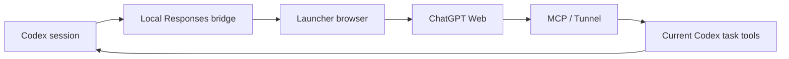

# Codex Web Harness

**Keep your Codex workflow. Run selected sessions through ChatGPT Web.**

[简体中文](README.zh-CN.md) · [Installation & profiles](docs/GETTING_STARTED.md) · [Build & release](docs/BUILDING.md) · [Troubleshooting](TROUBLESHOOTING.md)

[](https://github.com/cloverpray/codex-web-harness/actions/workflows/ci.yml)
[](LICENSE)
[](docs/VALIDATION.md)

An unofficial desktop launcher and local Responses bridge for using ChatGPT Web from Codex. This fork focuses on reliable long sessions, opt-in routing, smaller repeated prompts, and bounded tool coordination.

Derived from [miuuyy/codex-chatgpt-web](https://github.com/miuuyy/codex-chatgpt-web). See [provenance and changes](docs/CHANGES.md). This project is not affiliated with OpenAI.

## Why this fork?

- **Opt-in Web sessions.** Configure a Web profile, then use `codex` for your existing native setup and `codex -p web` for the browser route.
- **Long-session recovery.** Handles Codex 0.154 Responses-based text compaction, alongside existing compaction protocols.
- **Less repeated context.** Confirmed retained conversations receive new context without resending unchanged static instructions.
- **Bounded failures.** Rejects recursive bridge calls; deterministic environment errors return before streaming begins.
- **Task-bound tools.** Full mode connects the current Codex task's tools through MCP, retaining the native permission boundary.
- **Optional research utilities.** Read-only state snapshots, compact evidence packets, and an evidence-only teacher configuration live in [`extras/research`](extras/research). They are not installed automatically.



## Get started

1. Download the matching installer from [Releases](https://github.com/cloverpray/codex-web-harness/releases). Before a release is published, preview packages are available in successful [CI runs](https://github.com/cloverpray/codex-web-harness/actions/workflows/ci.yml).
2. Open the launcher and sign in to ChatGPT in its embedded browser.
3. Follow the browser verification and model setup steps. For local tools, complete the launcher's MCP/Tunnel setup and **Verify runtime**.
4. Configure the opt-in profile using [the profile guide](docs/GETTING_STARTED.md). Installing the app alone does **not** automatically create the `web` profile.

With the profile configured:

```bash
# Existing native configuration
codex

# Explicit Web session
codex -p web -m chatgpt-web/high -c model_reasoning_effort=high

# Pro, when available in the signed-in account
codex -p web -m chatgpt-web/pro -c model_reasoning_effort=ultra

# Resume an existing Web task
codex -p web resume YOUR_SESSION_ID
```

The model slug selects the Web effort. Availability depends on the account and current ChatGPT interface. `High` and `Pro` are Web routes, not a promise of identical native model snapshots or reasoning budgets.

## Platforms and validation

| Platform | Package | Validation for this fork |
|---|---|---|
| Linux x64 | AppImage | Local authenticated workflow exercised; CI builds and smoke tests |
| Windows x64 | Installer `.exe` | CI target; authenticated end-to-end validation still required |
| macOS arm64 / x64 | `.dmg`, `.zip` | CI targets; authenticated end-to-end validation still required |

The last pre-extraction Linux runtime suite passed **716 tests, with 1 platform skip**. A long-session recovery test completed compaction and the following reply; a subsequent resume also completed. These are correctness observations, **not a native-versus-Web speed benchmark**. Current source validation and release status are recorded in [VALIDATION.md](docs/VALIDATION.md).

## Build from source

The source build requires Bun 1.4.0. Node.js is also used by launcher packaging and tests.

```bash
git clone https://github.com/cloverpray/codex-web-harness.git
cd codex-web-harness
bun install --frozen-lockfile
cd launcher
bun install --frozen-lockfile
cd ..
bun run app
```

For native packages, verification, pinned dependencies, and GitHub Actions instructions, see [BUILDING.md](docs/BUILDING.md). Build each package on its matching OS; the app embeds a native runtime. Reproducible here means a documented, locked-input build process—not guaranteed byte-identical signed installers.

## Know the tradeoffs

- Browser interaction and MCP round trips add latency. Tool-heavy workloads can be substantially slower than native Codex.
- Compaction preserves a summary, not every detail. Keep authoritative state in files and verified artifacts.
- Web token usage is estimated; do not use it as a billing or cache-hit measurement.
- The experimental MCP batch tool remains **disabled by default**. Existing native command batching remains available.
- This does not remove subscription requirements, account limits, or workspace restrictions. Model API credentials are distinct from credentials a Full-mode Tunnel setup may require.
- Prompts and selected tool outputs are sent to ChatGPT; this is not local-only inference. Browser UI changes may require compatibility updates.
- Research teacher role templates are optional and require their hook integration to be verified on the target Codex version. A read-only label alone is not sufficient.

## Contribute

Useful contributions include reproducible bug reports, Windows/macOS validation, reduced latency traces, and focused regression tests. Include OS, app/Codex versions, expected behavior, and redacted errors. Never attach credentials, browser profiles, or private task history.

See [CONTRIBUTING.md](CONTRIBUTING.md), [SECURITY.md](SECURITY.md), and [the roadmap](docs/ROADMAP.md). If this project helps your workflow, a star makes it easier for others to discover it.

## License

[MIT](LICENSE). Original copyright and third-party notices are retained. Thanks to the upstream project and its contributors.
