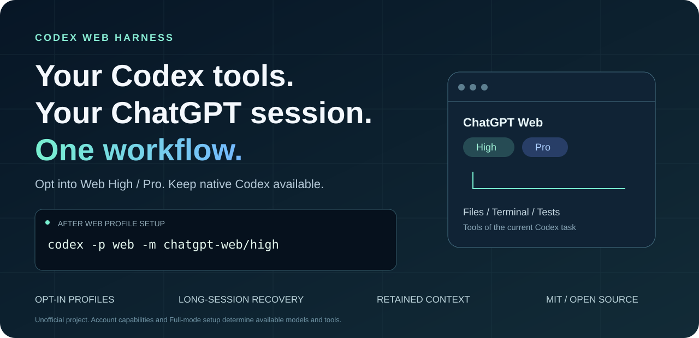

# Codex Web Harness

**保留 Codex 工作流，为指定会话接入 ChatGPT 网页端。**

[English](README.md) · [安装与模式配置](docs/GETTING_STARTED.md) · [构建与发布](docs/BUILDING.md) · [故障排查](TROUBLESHOOTING.md)

[](https://github.com/cloverpray/codex-web-harness/actions/workflows/ci.yml)
[](LICENSE)
[](docs/VALIDATION.md)



这是一个非官方桌面启动器与本地 Responses 桥接器，让 Codex 会话通过 ChatGPT 网页端运行。本分支重点改进长会话恢复、显式路由切换、重复上下文传输和工具等待。

基于 [miuuyy/codex-chatgpt-web](https://github.com/miuuyy/codex-chatgpt-web)，保留原许可证与贡献者归属。[来源与改动](docs/CHANGES.md)。本项目与 OpenAI 无隶属关系。

## 能帮开发者做什么？

| 开发任务 | 如何使用 |
|---|---|
| 排查仓库问题 | 让网页模型读取选定文件、运行权限允许的本地命令，并结合测试结果继续分析。 |
| 审查或实现代码修改 | 保留 Codex 终端、任务上下文和工具展示，按需选择可用的网页推理档位。 |
| 持续调查复杂问题 | 在支持的压缩流程后恢复任务，关键检查点和产物仍保存在磁盘。 |
| 获取第二意见 | 可选用 [Pro 教师](extras/research)阅读紧凑证据包，由主执行者承担全部写入。 |
| 保留原生 Codex | 通过显式 Web profile 选择路线，不要求所有会话都经过网页。 |

**适合：** 希望在现有 Codex 工作流中使用 ChatGPT 网页推理档位，且能够接受浏览器传输开销的开发者。**不太适合：** 大量微小、顺序工具调用，或要求与原生后端行为完全一致的场景。

## 原版的优势，我们增加的改进

原版提供了核心能力：跨平台桌面启动器、内置 ChatGPT 登录、网页推理档位、回传 Codex 的流式输出，以及通过 MCP 使用当前任务工具。本分支是在这些能力上继续改进。

| 方面 | 上游 v5.0.6 基础能力 | 本预览版新增 |
|---|---|---|
| 本地工具工作流 | 通过 MCP 连接 Codex 任务工具 | 在发现、分发和嵌套执行处补充递归保护 |
| 模型路由 | 启动器管理模型集成 | 显式 Web profile 与独立模型目录 |
| 长会话 | 已有压缩和任务续接 | 补齐 Codex 0.154 普通 Responses 文本压缩恢复 |
| 上下文传输 | 与任务绑定的可复用会话 | 省略不变静态指令及已确认传输的历史前缀 |
| 故障处理 | 浏览器及桥接生命周期管理 | 流式响应前拒绝确定性环境错误，明确取消是否收尾 |
| 教师协调 | 固定30秒 Web 等待 | 无工具教师可用有界55秒选项，工作子模型保留30秒建议 |

这些是相对于记录的上游基线的实现差异，不代表原版所有场景都有故障，也不代表本分支全面更快。[改动与来源](docs/CHANGES.md) · [验证范围](docs/VALIDATION.md)。

## 工作方式


<details>
<summary><strong>查看继承的启动器界面演示</strong></summary>


该演示来自上游项目，保留归属说明。它不是本分支新增压缩或耗时测试的录像；当前行为和限制以下文为准。

</details>

## 快速开始

1. 在 [Releases](https://github.com/cloverpray/codex-web-harness/releases) 下载对应安装包。尚未发布 Release 时，可从成功的 [CI 构建](https://github.com/cloverpray/codex-web-harness/actions/workflows/ci.yml) 下载预览产物。
2. 启动应用，在内置浏览器中登录 ChatGPT。
3. 完成浏览器验证和模型设置。需要本地工具时，按启动器指引完成 MCP/Tunnel 配置，并运行 **Verify runtime**。
4. 按[模式配置指南](docs/GETTING_STARTED.md)建立显式 Web profile。**仅安装应用不会自动创建 `web` profile。**

配置完成后：

```bash
# 沿用原生配置
codex

# 显式使用 Web High
codex -p web -m chatgpt-web/high -c model_reasoning_effort=high

# 账户可用时使用 Web Pro
codex -p web -m chatgpt-web/pro -c model_reasoning_effort=ultra

# 恢复原 Web 会话
codex -p web resume YOUR_SESSION_ID
```

网页档位由模型路由决定，账户和界面决定可用范围。Web High／Pro 不代表与原生 Codex 使用完全相同的模型快照或推理预算。

## 平台与验证状态

| 平台 | 安装包 | 本分支验证范围 |
|---|---|---|
| Linux x64 | AppImage | 已做本地登录后的真实工作流验证；CI 构建与冒烟测试 |
| Windows x64 | `.exe` 安装器 | CI 构建目标；仍需真实登录、工具与压缩验证 |
| macOS arm64／x64 | `.dmg`、`.zip` | CI 构建目标；仍需真实登录后的端到端验证 |

整理发行源码前，Linux 运行时全量测试为 **716 通过、1 项平台跳过**，并验证了长会话自动压缩、继续回复及再次恢复。这些结果证明特定流程可用，**不代表已经完成原生／Web 速度或研究质量对照**。最新状态见 [VALIDATION.md](docs/VALIDATION.md)。

## 从源码运行

需要 Bun 1.4.0；启动器测试和打包还会使用 Node.js。

```bash
git clone https://github.com/cloverpray/codex-web-harness.git
cd codex-web-harness
bun install --frozen-lockfile
cd launcher
bun install --frozen-lockfile
cd ..
bun run app
```

跨平台打包和 GitHub Actions 见 [BUILDING.md](docs/BUILDING.md)。每个平台需在对应系统构建，因为安装包内含原生运行时。这里的可复现是指依赖锁定、步骤明确、可重新构建，不保证签名安装包逐字节一致。

## 使用边界

- 浏览器和 MCP 往返会增加延迟，工具密集任务可能明显慢于原生 Codex。
- 自动压缩生成摘要，不保证保留所有细节；任务状态以文件和已验证产物为准。
- token 用量为估算，不能作为计费或缓存命中的准确证据。
- 实验性 MCP 批处理工具仍默认关闭；可以使用现有原生命令合并独立读取。
- 本项目不消除订阅、用量或工作区限制。模型 API 密钥与 Full 模式 Tunnel 可能需要的凭据不是同一件事。
- 提示词和选定工具结果会发送至 ChatGPT，并非纯本地推理。网页界面变化可能影响兼容性。
- 可选教师配置需要在目标 Codex 版本验证钩子是否生效，不能仅凭“只读”标签判定权限已收窄。

## 参与改进

欢迎提交可复现问题、Windows/macOS 实测记录、脱敏耗时证据和针对性测试。请附操作系统、应用/Codex 版本及预期结果；不要上传凭据、浏览器资料或私人任务历史。

[贡献指南](CONTRIBUTING.md) · [安全报告](SECURITY.md) · [路线图](docs/ROADMAP.md)。如果对你的工作有帮助，欢迎 Star，让更多需要的人找到项目。

## 许可证

[MIT](LICENSE)，保留原作者版权及第三方许可说明。感谢上游项目及贡献者。
